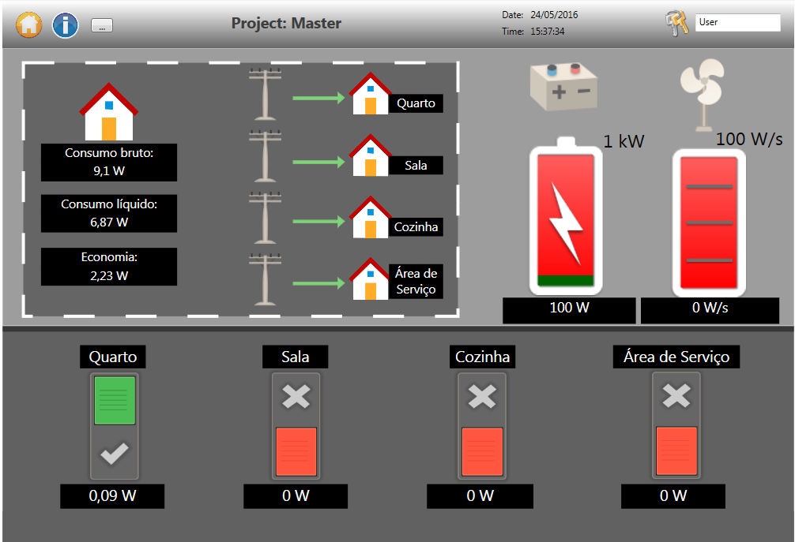
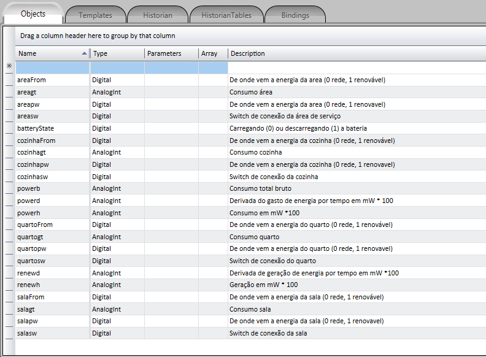
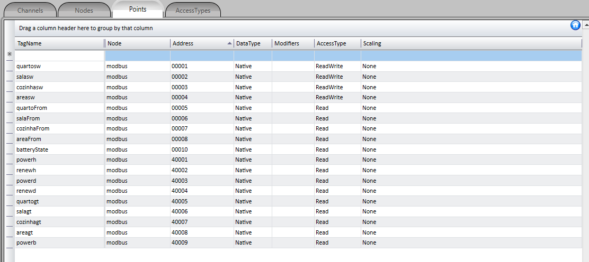
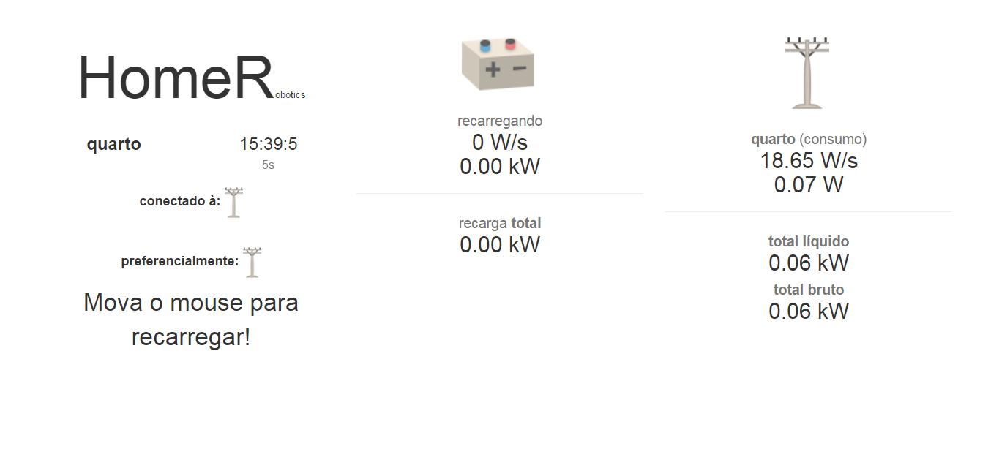
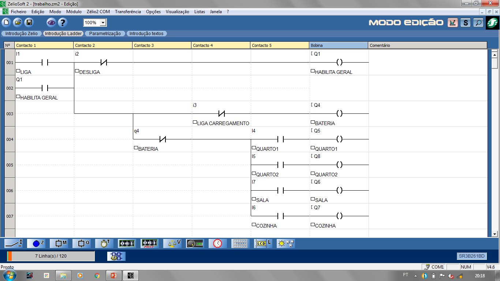
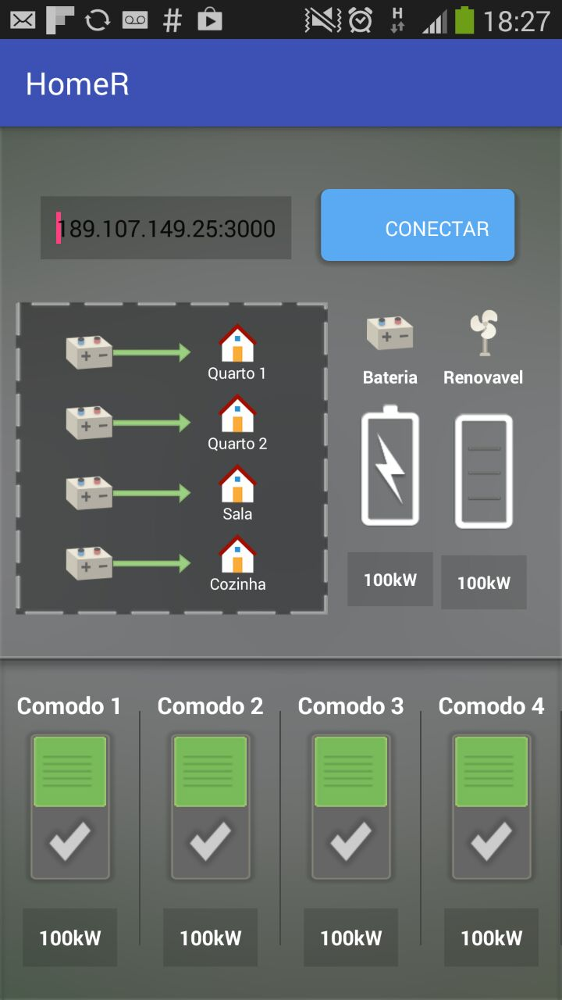

# HomeR
Trabalho de automação residencial utilizando supervisório blueplant, protocolo modbus TCP/IP, servidor NodeJS e ESP8266.

## Autores
[Gustavo Domingueti](https://github.com/GustavoDominguetti), [Pedro Henrique](https://www.facebook.com/pedro.hc.do), [Raphael Brandão](https://www.facebook.com/raphaelbs)

## Demo
[Apresentação .pptx](./Trabalho%20de%20Dom%C3%B3tica.pptx)

[Youtube](https://youtu.be/CZUL37YRlck)

## Screenshots

Tela principal do supervisório: 

Blueplant Tags: 

Blueplant Points: 

Tela principal do demonstrativo Http: 

Programação no Zélio: 

Android: 

